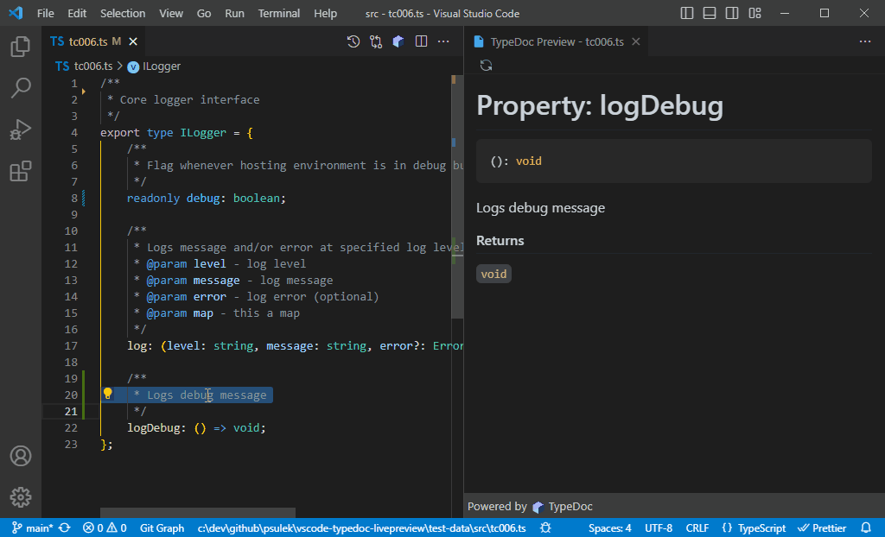

# TypeDoc Live Preview for Visual Studio Code

A `vscode` extension to show live preview of typescript documentation using `tsdoc` or [typedoc](https://typedoc.org/) markup within your typescript files.

## Features

### Light & dark theme support (autodetect)
Theme (light or dark) is automatically detect from vscode theme.

### Show/hide empty signatures
Show or hide methods/fuctions with no documentation signatures.

## Commands

| Command                                                         | Keybinding       |
| ----------------------------------------------------------------| ---------------- |
| TypeDoc Live Preview: Open Preview to the Side                  | `Ctrl + Alt + P` |
| TypeDoc Live Preview: Reload Preview                            | none             |
| TypeDoc Live Preview: Show empty signatures                     | none             |
| TypeDoc Live Preview: Hide empty signatures                     | none             |
| TypeDoc Live Preview: Refresh Typescript library types cache    | none             |

## Install

1. Open **Extensions** sideBar panel in Visual Studio Code and choose the menu options for **View → Extensions**
1. Search for `typedoc-live-preview`
1. Click **Install**
1. Click **Reload**, if required

## Configuration

This extension contributes the following settings:

| Setting                             | Description                                      | Default | Values |
| ----------------------------------- | ------------------------------------------------ | ------- | ------ |
| typedoclivepreview.emptySignatures  | Show or hide empty methods/fuctions signatures   | `show`  | `show`,`hide` |

## Release Notes

[Have a look at our CHANGELOG][changelog] to get the details of all changes.

### 1.0.0

Initial release of `TypeDoc Live Preview` extension

<!-- Links -->
[changelog]: https://github.com/psulek/vscode-typedoc-livepreview/blob/main/CHANGELOG.md