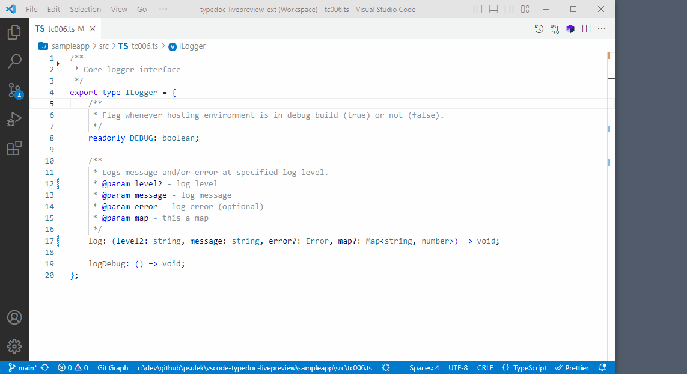
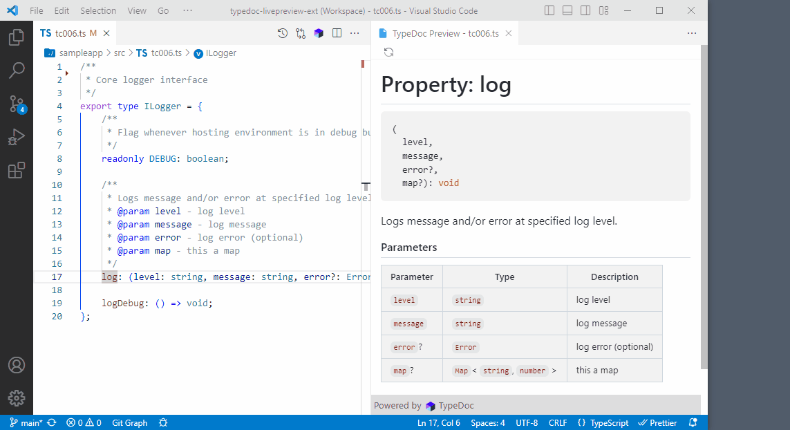
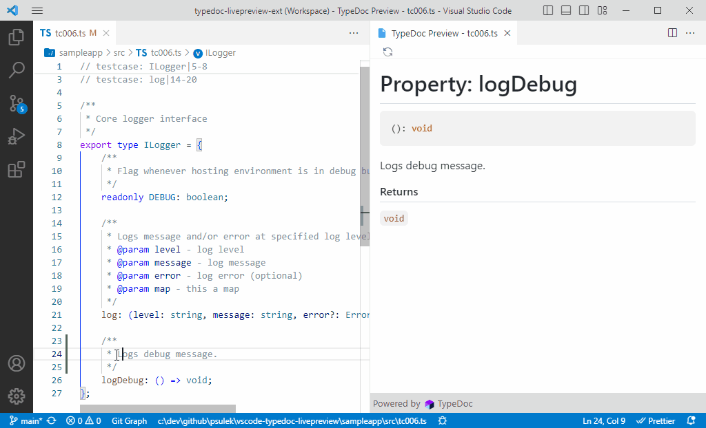

# TypeDoc Live Preview for Visual Studio Code

A `vscode` extension to show live preview of typescript documentation using `tsdoc` or [typedoc](https://typedoc.org/) markup within your typescript files.

## Features

- Live preview of typescript documentation (tsdoc or typedoc)
- Light & dark theme support (autodetect)

- Show or hide empty methods/fuctions signatures

## Commands

| Command                               | Keybinding   |
| ------------------------------------- | ------------ |
| TypeDoc Live Preview: Open Preview to the Side | `Ctrl + Alt + P` |
| TypeDoc Live Preview: Reload Preview           | none         |

## Install

1. Open **Extensions** sideBar panel in Visual Studio Code and choose the menu options for **View → Extensions**
1. Search for `typedoc-live-preview`
1. Click **Install**
1. Click **Reload**, if required

## Settings

This extension contributes the following settings:

| Property                            | Description                                      | Default | Values |
| ----------------------------------- | ------------------------------------------------ | ------- | ------ |
| typedoclivepreview.emptySignatures  | Show or hide empty methods/fuctions signatures   | `show`  | `show`,`hide` |

### 1.0.0

Initial release of `TypeDoc Live Preview` extension